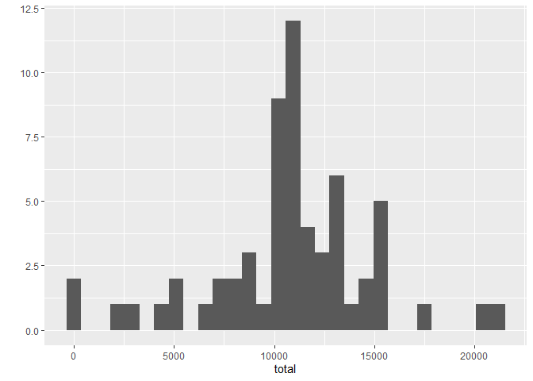

## Loading and preprocessing the data

```r
file <- read.csv("activity.csv")
```

## What is mean total number of steps taken per day?

```r
temp <- file %>% group_by(date) %>% summarise(total = sum(steps)) %>% mutate(date = as.Date(date))

qplot(total, data = temp, xlab = "total steps per day", ylab = "frequency",)
```

```
## `stat_bin()` using `bins = 30`. Pick better value with `binwidth`.
```

```
## Warning: Removed 8 rows containing non-finite values (stat_bin).
```

<!-- -->

```r
sprintf("Mean: %f", mean(temp$total,na.rm = TRUE))
```

```
## [1] "Mean: 10766.188679"
```

```r
sprintf("Median: %f", median(temp$total, na.rm = TRUE))
```

```
## [1] "Median: 10765.000000"
```


## What is the average daily activity pattern?

```r
temp <- file %>% drop_na(steps) %>% group_by(interval) %>% summarise(avg = mean(steps))
qplot(interval, avg, data = temp, geom = "line")
```

<!-- -->

```r
maxInt <- temp$interval[which.max(temp$avg)]
sprintf("Max Interval is %i", maxInt)
```

```
## [1] "Max Interval is 835"
```

## Imputing missing values

```r
sumNa <- sum(is.na(file$steps))
sprintf("Sum of row with NA is %i", sumNa)
```

```
## [1] "Sum of row with NA is 2304"
```

```r
fileNoNa <- file %>% group_by(date) %>% mutate(newsteps = ifelse(is.na(steps),mean(steps,na.rm = TRUE),steps))

temp1 <- fileNoNa %>% summarise(total = sum(steps))

qplot(total, data = temp1)
```

```
## `stat_bin()` using `bins = 30`. Pick better value with `binwidth`.
```

```
## Warning: Removed 8 rows containing non-finite values (stat_bin).
```

<!-- -->

```r
sprintf("Mean: %f", mean(temp1$total,na.rm = TRUE))
```

```
## [1] "Mean: 10766.188679"
```

```r
sprintf("Median: %f", median(temp1$total, na.rm = TRUE))
```

```
## [1] "Median: 10765.000000"
```

## Are there differences in activity patterns between weekdays and weekends?

```r
bool <- wday(ymd(file$date)) %in% c(1,7)

temp <- file %>% drop_na(steps) %>% mutate(wday = ifelse(wday(ymd(date)) %in% c(1,7), "weekend", "weekday")) %>% group_by(wday,interval) %>% summarise(avg = mean(steps))
```

```
## `summarise()` has grouped output by 'wday'. You can override using the
## `.groups` argument.
```

```r
qplot(interval, avg, data = temp, geom = "line", facets = wday~"" )
```

<!-- -->
